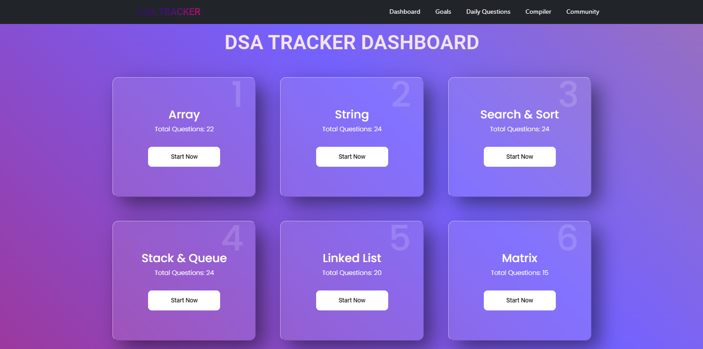

# DSA TRACKER - All solutions for your DSA problems
:tipping_hand_man: A website that contains important questions for data structure and algorithms with many features like community, goals, compiler, etc.

## Overview :eyes:


## About :thinking:
DSA Tracker is a comprehensive collection of important questions of data structure compiled together to boost your skills and prepare you for placement exams.
Our website has many features that will help you to keep yourself motivated and involved in DSA.

## Features :gift:
- **Important Topic Wise Questions**
- **Set your Goals**
- **Daily Questions**
- **Online Compiler**
- **Community Chat Section**
- **Local Storage**
- **Clean UI**
- **Fully Optimized for Mobile Devices**

## Dependencies :books:
- **[React](https://react.dev/) - Frontend**
- **[Bootstap](https://react-bootstrap.github.io/) and [Material UI](https://mui.com/) - Navbar and miscellaneous**
- **[Font Awesome](https://fontawesome.com/) - Emojis**
- **[Monaco](https://www.npmjs.com/package/@monaco-editor/react) - Code Editor**
- **[ReactGA](https://www.npmjs.com/package/react-ga) - Google Analytics**

## Installations and Setup :desktop_computer:
```
git clone https://github.com/nilotpaul/dsatracker.git
npm install
npm run dev
```

## Credits :handshake:
- The questions in the website is based on [DSA Cracker Excel Sheet](https://drive.google.com/file/d/1FMdN_OCfOI0iAeDlqswCiC2DZzD4nPsb/view) from [Love Babbar](https://www.linkedin.com/in/love-babbar-38ab2887/)
- The [Compiler](https://github.com/manuarora700/react-code-editor) is from [Manu Arora](https://github.com/manuarora700)
- The [Chat System]() has been made by my friend [Soham Basak]()
